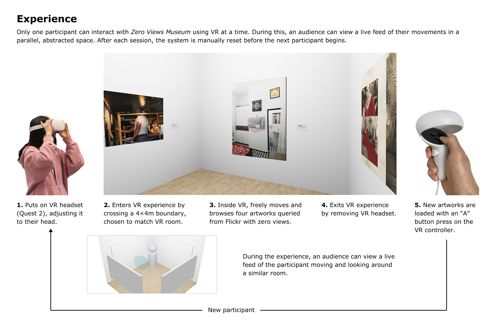
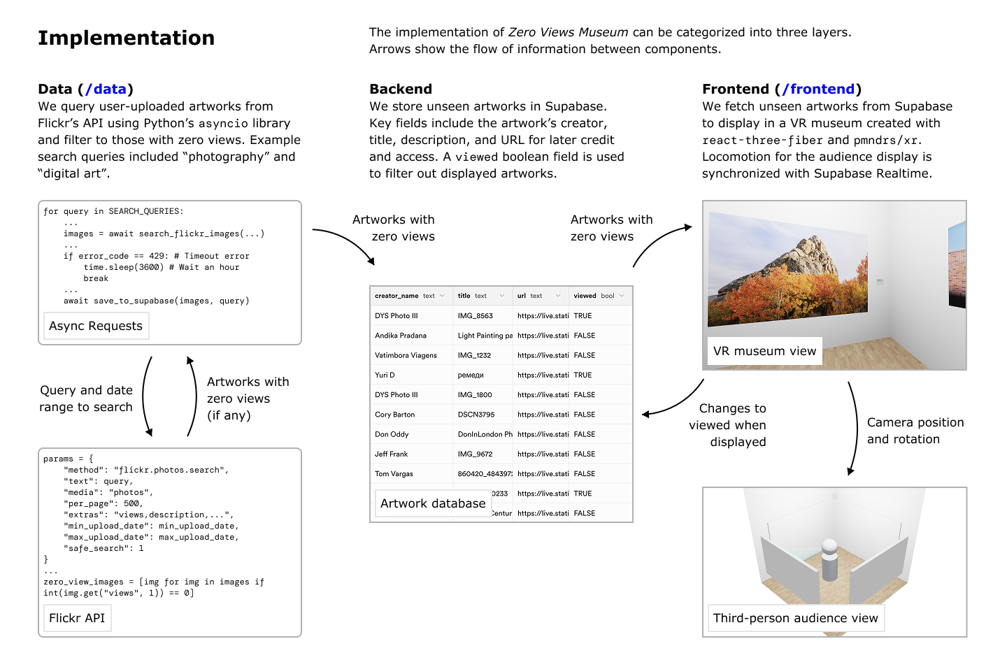

# Zero Views Museum

Our consumption of art is increasingly shaped by algorithms. These systems equate virality with value; the more views an artwork has, the better it must be and the more it deserves to be shown.

_Zero Views Museum_ acts as a counterfunctional algorithm by only exhibiting artworks with zero views. Once experienced, they are erased from our database — making you both the first and potentially last person to see them.

This encounter invites reflection: Are algorithms good arbiters of artistic worth? What unseen works have already been lost? And does our perception of art change when we know we can never see it again?

[Click here for a demo video of the experience.](https://www.youtube.com/watch?v=OyhZxtvqi-U)

## Cloning and Running

### Data (`/data`)

In an `.env` file, you need to define the following environment variables:

- `FLICKR_API_KEY` - Your Flickr API key.
- `SUPABASE_URL` - The URL of your Supabase instance.
- `SUPABASE_KEY` - The API key for your Supabase instance.

Then, create a virtual Python environment, install the Python requirements via `requirements.txt`, and activate the environment. [Instructions for installing Python packages in a virtual environment are available here.](https://packaging.python.org/en/latest/guides/installing-using-pip-and-virtual-environments/)

To run the Flickr API querying, run `python flickr.py`. `SEARCH_QUERIES` can be modified based on artwork categories of interest.

### Frontend (`/frontend`)

In an `.env` file, you need to define the following environment variables:

- `NEXT_PUBLIC_SUPABASE_URL` - The URL of your Supabase instance.
- `NEXT_PUBLIC_SUPABASE_KEY` - The API key for your Supabase instance.

After installing Node dependencies with `npm i`, run the Next.js server with `npm run dev`.

The VR museum interface is available at the root `/`, and the audience view at `/third-person`.

For development on localhost, the [Immersive Web Emulation Runtime (IWER)](https://developers.meta.com/horizon/blog/immersive-web-emulation-runtime-iwer-webxr-meta-quest-developer/) is available to emulate VR without requiring a headset.

If accessing a deployed version of the frontend such as [our existing deployment](https://zero-views-museum.vercel.app/), a VR headset is necessary to interact with the museum.
