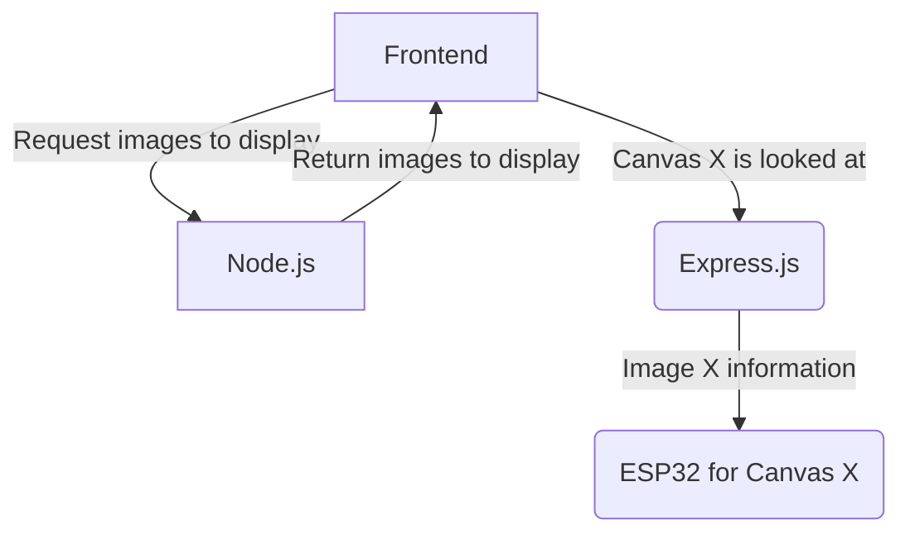

# Zero Views Museum

Our consumption of art is increasingly shaped by algorithms. These systems equate virality with value; the more views an artwork has, the better it must be and the more it deserves to be shown.

_Zero Views Museum_ acts as a counterfunctional algorithm by only exhibiting artworks with zero views. Once experienced, they are erased from our database — making you both the first and potentially last person to see them.

This encounter invites reflection: Are algorithms good arbiters of artistic worth? What unseen works have already been lost? And does our perception of art change when we know we can never see it again?

[Click here for a demo video of the experience.](https://www.youtube.com/watch?v=OyhZxtvqi-U)

## Cloning and Running

### Data (`/data`)

In an `.env` file, you need to define the following environment variables:

- `FLICKR_API_KEY` - Your Flickr API key.
- `SUPABASE_URL` - The URL of your Supabase instance.
- `SUPABASE_KEY` - The API key for your Supabase instance.

Then, create a virtual Python environment, install the Python requirements via `requirements.txt`, and activate the environment. [Instructions for installing Python packages in a virtual environment are available here.](https://packaging.python.org/en/latest/guides/installing-using-pip-and-virtual-environments/)

To run the Flickr API querying, run `python flickr.py`. `SEARCH_QUERIES` can be modified based on artwork categories of interest.

### Frontend (`/frontend`)

In an `.env` file, you need to define the following environment variables:

- `NEXT_PUBLIC_SUPABASE_URL` - The URL of your Supabase instance.
- `NEXT_PUBLIC_SUPABASE_KEY` - The API key for your Supabase instance.

After installing Node dependencies with `npm i`, run the Next.js server with `npm run dev`.

The VR museum interface is available at the root `/`, and the audience view at `/third-person`.

For development on localhost, the [Immersive Web Emulation Runtime (IWER)](https://developers.meta.com/horizon/blog/immersive-web-emulation-runtime-iwer-webxr-meta-quest-developer/) is available to emulate VR without requiring a headset.

If accessing a deployed version of the frontend such as [our existing deployment](https://zero-views-museum.vercel.app/), a VR headset is necessary to interact with the museum.

## Networking

Due to concerns over cellular access being poor due to festival crowds, I chose to host the experience through a local Wi-fi network (without Internet).

- My leading hypothesis for this is that, without Internet, the Quest browser cannot verify the certification by contacting OCSP or CRL servers.

Key design constraints:

1. HTTPS is necessary because of security requirements of WebXR.
2. Quest 2 VR headsets appear to be more strict of SSL certification without Internet. It will load local resources from the frontend when Internet is accessible, but will fail to without.

Network components:

1. r3f/xr VR museum frontend. Hosted locally through `NODE_TLS_REJECT_UNAUTHORIZED=0 next dev --experimental-https --experimental-https-key ../certificates/vr-museum-key.pem --experimental-https-cert ../certificates/vr-museum.pem`, so that it's accessible by the Quest 2 VR headsets. Relevant documentation: https://nextjs.org/docs/pages/api-reference/cli/next#using-https-during-development. These key and cert values were generated manually with (`/certificates/generate_certificates.sh`).

   - IP address: fixed, specified through internal Mac network settings at port 3000 (e.g. `10.10.10.140:3000`).

2. Node.js image API server. Provides an API to access a SQLite clone of the Supabase artworks database locally through methods such as `/api/artworks/<artwork_id>`.

   - IP address: fixed, specified to match frontend IP at port 5001 (e.g. `10.10.10.140:5001`).

3. Express.js WebSocket server. This routes commands from the frontend to the correct IP addresses of the development boards.

   - IP address: fixed, runs through the same address as the frontend at port 3001 (e.g. `10.10.10.140:3001`).

4. ESP32 development boards, one for each canvas. Receives communication from the WebSocket server, fades in and out the necessary images.

   - IP address: octet is manually specified in each `main.cpp` that's flashed ot the device, always port 80 (e.g. `10.10.10.{105, 106, 107, 108}:80`).

Learnings (from my current understanding):

- Whether I use a self-signed certificate or a certificate from a public CA (Let's Encrypt + `certbot` + `dnsmasq` pointing an owned domain (`zvm.jaydenh.com`) to my local development server), because my Quest 2 VR headset cannot verify the legitimacy of this certificate through OCSP servers, it refuses to consistently load the resources.
- With `adb shell am start -n com.android.settings/.Settings\$NetworkDashboardActivity`, I can access the Quest 2's hidden Android settings where Security & Privacy -> More Security & Privacy -> I can install custom CA certificates here. From trial and error, it seems to only accept root CA certificates? Otherwise I encounter a "Private key is necessary" error. I can push files from my laptop to the Quest 2 through `adb push {file} /sdcard/Download/`.
